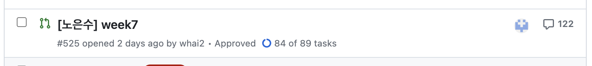

# Part2 멘토링 (240213)

## 목차

- 경험했던 기술스택
- React 컨벤션 조금만 더 보기
- 코드 리뷰 같이 보기
- 개발 공부 이야기

## 경험했던스택

### 저는 이런 기술들을 써봤어요

- HTML
- CSS, SCSS(Module), TailwindCSS, Styled-Components, Emotion, Vanilla Extract
- JavaScript, TypeScript
- React, Next.js
- Vue, Nuxt.js
- Express, Nest.js
- React-Query, Redux, Recoil, Pinia
- AWS, Docker
- 그 외에 다양한 라이브러리들

## React 컨벤션 조금만 더 보기

### 절대 경로를 사용해요

```js
import { useState } from 'react';

import UserList from '../../../../../components/user/user-list/user-list';
```

```js
import { useState } from 'react';

import UserList from '@/components/user/user-list/user-list';
```

### import도 순서가 있어요

- builtin
- internal
- external
- [eslint-plugin-import](https://github.com/import-js/eslint-plugin-import/blob/main/docs/rules/order.md)
- [참조](https://pozafly.github.io/environment/putting-rules-into-import-syntax-with-eslint/)

```js
import { useState } from 'react';
import axios from 'axios';

import Folder from '../components';

import { ROUTES_PATHS } from '../constants';

import { formatDate } from '../utils';
```

```js
import { useState } from 'react';
import axios from 'axios';

import Folder from '../components';
import { ROUTES_PATHS } from '../constants';
import { formatDate } from '../utils';
```

### Styled-Components

- 컴포넌트와 같이 두기

```js
export default function Header() {
  return (
    <Container>
      <Wrapper>
        <Left>Logo</Left>
        <Right>로그인</Right>
      </Wrapper>
    </Container>
  );
}

const Container = styled.header`
...
`;

const Wrapper = styled.div`
...
`;

const Left = styled.div`
...
`;

const Right = styled.div`
...
`;
```

- 별도의 파일로 분리하기
- Header.styled.ts

```js
export const Container = styled.header`
...
`;

export const Wrapper = styled.div`
...
`;

export const Left = styled.div`
...
`;

export const Right = styled.div`
...
`;
```

### 라우트 경로도 상수로 관리해요

- 휴먼 에러 방지

```js
export const ROUTE_PATHS = {
  HOME: '/home',
  PRODUCT: '/product',
  FOLDER: '/folder',
};
```

### 반복되는 라우트도 상수로 관리해요

```js
const ROUTES = [
  {
    path: ROUTE_PATHS.HOME,
    element: <Home />,
  },
  {
    path: ROUTE_PATHS.PRODUCT,
    element: <Product />,
  },
];

return (
  <Routes>
    {ROUTES.map({path, element} => <Route key={path} path={path} element={element} />)}
  </Routes>
)
```

## 코드리뷰 같이 보기

### 계속 티키타카하기



- 기본적으로는 깃허브를 이용한 비동기 커뮤니케이션
- 필요하다면 DM으로

### 리뷰는 모두 반영할 필요가 없다

- 나와 생각이 다르다면?
- 현실적으로 반영하기

### 리액트는 첫 렌더링때 하얗다

- 처음에는 데이터가 없어요
- 데이터가 없을때는...
  - Loading Spinner
  - Skeleton
  - empty
- 동작에 대한 반응이 없으면 유저는 이상하게 느껴요

### 상수는 바깥쪽에

```js
function Component(id) {
  const TEST_ID = 'test@codeit.com';
  const USERS = ['kim', 'yu'];

  useEffect(() => {
    if(id === TEST_ID) {
      ...
    }
  }, [])

  return {
    <ul>
      {USERS.map(user => <li key={user.id}>{user.name}</li>)}
    </ul>
  }
}
```

### noscript가 뭐지?

```html
<body>
  <noscript>You need to enable JavaScript to run this app.</noscript>
  <div id="root"></div>
</body>
```

### YAGNI

- 미리 할 필요는 없다.
- 그러나 미리 할 필요도 있다.
- [참고](https://johngrib.github.io/wiki/jargon/yagni/)

### 변수명은 데이터 형식에 따라서도 달라진다

```js
const [folderLinks, setFolderLinks] = useState([]);
const [folderOwner, setFolderOwner] = useState([]);
const [folderName, setFolderName] = useState([]);
```

### useEffect는 하나의 일만 해요

```js
useEffect(() => {
  const fetchFolder = async () => {
    const { folder } = await getFolder();
    const { links } = folder;
    const { name, owner } = folder;

    setFolderLinks(links);
    setFolderOwner(owner);
    setFolderName(name);
  };

  const fetchUser = async () => {
    const userInfo = await getUser();
    const { email, name, profileImageSource } = userInfo;

    setUser({ email, name, profileImageSource });
  };

  fetchFolder();
  fetchUser();
}, []);
```

### props를 넘겨줄 때는

- 뭐가 더 좋을까?
- 무슨 차이가 있을까?

```js
<Card
  imgSrc={item.imageSource}
  title={item.title}
  description={item.description}
  time={item.createdAt}
  url={item.url}
/>

<Card {...item} />
```

### 리스트를 렌더링할 때 key

```js
  {items.map((item) => (
    <Card key={item.createdAt}
  ))}
```

- 유니크해야한다

### StrictMode

```js
<StrictMode>
  <App />
</StrictMode>
```

- 어떤 용도로 쓰는거지?

### 조건부 렌더링

```js
function LuckyBox({ isLogin }) {
  if (!isLogin) {
    return null;
  }

  return <div>LuckyBox!!!</div>;
}
```

```js
return (
  {isAdmin && <button type='button'>돈복사</button>}

  {isAdult ? <div>술</div> : <div>음료</div>}

  {isAdult && <div>술</div>}
  {!isAdult && <div>음료</div>}

  <Condition
    expression={folders.length > 0}
    then={<Folders items={folders} />}
    else={<NotFound />}
  />
)
```

## 개발 공부 이야기

### 저는 처음에...

- 무작정 프로젝트 하기
  - 개발 커뮤니티 만들기 (게시판, 채팅)
  - React, TypeScript, Express, socket
  - 망했지만 배운 건 있다

### 공부가 어려운 건 당연하다

- 공부는 정말 고통스럽다
- 조금 느리더라도 제대로 가는게 중요하다
- 남들과 비교할 필요 없다
